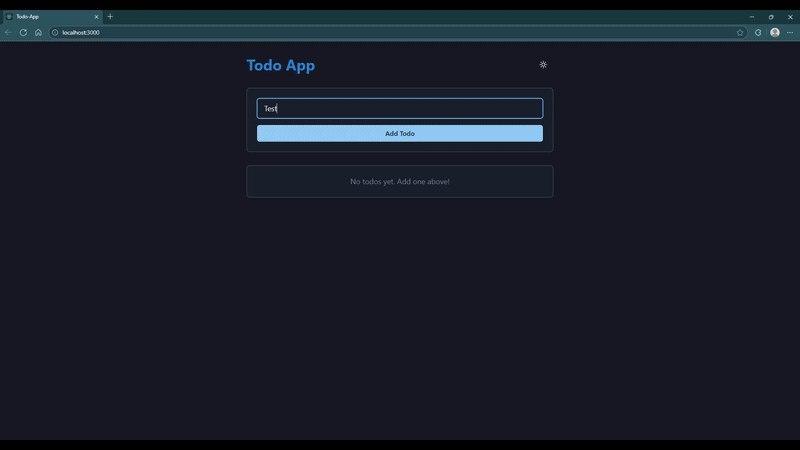

# Todo App

A really simple Todo app implementing CRUD operations, made with React.js (using components from Chakra UI) and Golang with MongoDB as the backend. I built this project mainly to learn and practice how to create a backend API in Go with the `net/http` package and consume the API from a frontend.

## Demo

[](./demo.mp4)

## Tech Stack

### **Backend**

- Go: Backend logic and REST API using `net/http`
- MongoDB: NoSQL database for storing todos

### **Frontend**

- React: Frontend framework for building UI
- Chakra UI: Component library for modern UI design
- Axios: For making HTTP requests to the backend

## Features

- Add new todos
- Delete existing todos
- Mark todos as completed
- Save and load todos from MongoDB
- Toggle between Dark and Light modes

## Setup Instructions

### **Backend**

1. Clone the repository
2. Navigate to the backend directory
3. Create a `.env` file with your MongoDB URI
4. Run the backend server:

   ```bash
   go run main.go
   ```

### **Frontend**

1. Navigate to the frontend directory
2. Install dependencies:

   ```bash
   npm install
   ```

3. Start the development server:

   ```bash
   npm start
   ```
